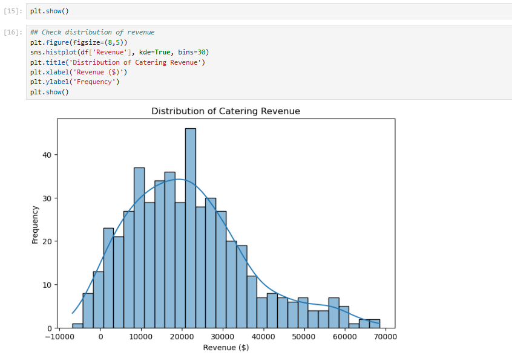
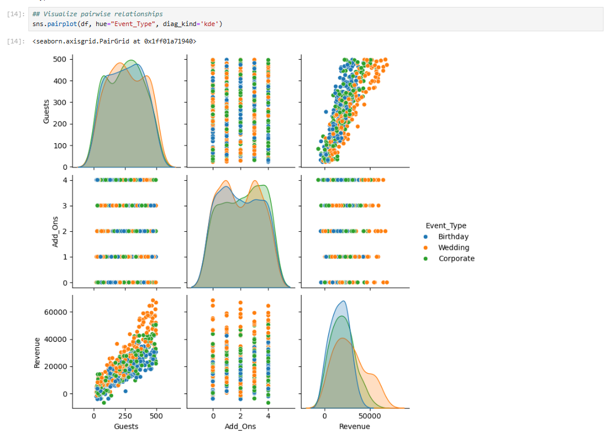
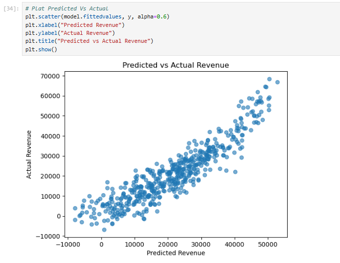

# 🍽️ Catering Event Revenue Prediction (Regression Analysis)

### 📊 Data Science + Financial Analytics Project

This project applies **Python-based regression modeling** to help a catering business **predict event revenue** using key business drivers — such as the number of guests, event type, menu tier, and add-ons.  

The objective is to enable sales and finance teams to **quote events more accurately** and identify which factors most influence profitability.

---

## 🚀 Project Overview

**Goal:**  
Develop a data-driven model to forecast catering event revenue and uncover the strongest predictors of profitability.

**Key Results:**
- Achieved an **R² = 0.8345** and **Adjusted R² = 0.8315**, meaning the model explains **83% of revenue variation**.  
- Found that **guest count, event type, and menu tier** are the most impactful variables.  
- Seasonal effects were **not statistically significant**, suggesting consistent pricing and demand throughout the year.

---

## 🛠️ Tools & Technologies

| Category | Tools |
|-----------|--------|
| **Programming** | Python |
| **Data Analysis** | Pandas, NumPy |
| **Modeling** | Statsmodels, Scikit-learn |
| **Visualization** | Matplotlib, Seaborn |
| **Environment** | Jupyter Notebook, VS Code |

---

## 🧩 Project Workflow

### 1️⃣ Data Generation  
Synthetic financial data was created to simulate 500 catering events with the following features:
- `Guests` (20–500)  
- `Event_Type` (Wedding, Corporate, Birthday)  
- `Menu_Tier` (Basic, Standard, Premium)  
- `Season` (Spring, Summer, Fall, Winter)  
- `Add_Ons` (0–5 optional services)

### 2️⃣ Exploratory Data Analysis (EDA)
- Explored variable distributions, correlations, and pairwise relationships.  
- Found strong linear relationships between revenue, guest count, and menu tier.




### 3️⃣ Regression Modeling
- Built an **Ordinary Least Squares (OLS)** regression model using `statsmodels`.  
- Evaluated coefficient significance, p-values, and regression assumptions.  
- Achieved robust performance with **Adjusted R² = 0.8315**.

---

## 🧾 Model Interpretation

| Variable | Coefficient | P-Value | Interpretation |
|-----------|-------------|---------|----------------|
| **Guests** | 86.02 | 0.000 | Each additional guest adds ≈ **\$86** to revenue. |
| **Add_Ons** | 369.12 | 0.054 | Each add-on contributes ≈ **\$369** to revenue (marginally significant). |
| **Event_Type_Corporate** | 3,806 | 0.000 | Corporate events earn ≈ **\$3,800** more than birthdays. |
| **Event_Type_Wedding** | 10,560 | 0.000 | Weddings earn ≈ **\$10,500** more than birthdays. |
| **Menu_Tier_Standard** | 4,735 | 0.000 | Standard menus earn ≈ **\$4,700** more than Basic menus. |
| **Menu_Tier_Premium** | 10,240 | 0.000 | Premium menus earn ≈ **\$10,200** more than Basic menus. |
| **Season Variables** | — | >0.05 | No statistically significant effect. |

---

### 📐 Regression Equation

**Revenue = -\$11,610**  
+ (\$86.02 × Guests)  
+ (\$369.12 × Add_Ons)  
+ (\$3,806 × Event_Type_Corporate)  
+ (\$10,560 × Event_Type_Wedding)  
+ (\$4,735 × Menu_Tier_Standard)  
+ (\$10,240 × Menu_Tier_Premium)  

*(Seasonal variables excluded — not statistically significant.)*

---

## 📈 Visual Insights

| Visualization | Description |
|----------------|-------------|
| **Pairplot / Correlation Matrix** | Reveals strong linear correlation between guests, menu tier, and revenue. |
| **Predicted vs Actual Scatterplot** | Shows high model accuracy and low residual error. |



```python
plt.scatter(model.fittedvalues, y, alpha=0.6)
plt.xlabel("Predicted Revenue")
plt.ylabel("Actual Revenue")
plt.title("Predicted vs Actual Revenue")
plt.show()
